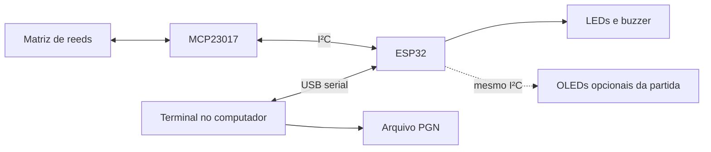

# Arquitetura e requisitos

O produto acompanha a ocupação de um tabuleiro 8×8, interpreta as transições após o pouso e a estabilização das peças e registra lances legais em PGN. Reeds detectam presença; não identificam peças. A posição lógica e o histórico de transições são informações distintas.

## Organização

```mermaid
flowchart LR
    M[Matriz de reeds] <--> X[MCP23017]
    X <-->|I²C| E[ESP32]
    PC[Terminal no computador] <-->|USB serial| E
    PC --> PGN[Arquivo PGN]
    E --> S[LEDs e buzzer]
    E -.->|mesmo I²C| O[OLEDs opcionais da partida]
```

A montagem adota USB do computador, regulador da DevKit V1, matriz direta e oito pull-ups de 47 kΩ. Conexões e parâmetros estão em [hardware.md](hardware.md).

| Componente | Responsabilidade |
| --- | --- |
| `Hardware` / aquisição | Varrer o MCP23017, publicar quadros completos e informar falhas. |
| `MoveTracker` | Preservar alterações de ocupação e confiabilidade da tentativa. |
| `ChessAdapter` | Manter posição, regras legais e SAN, usando THC local. |
| `MoveInterpreter` | Relacionar snapshot da tentativa e posição oficial sem modificar nenhum deles. |
| `GameController` | Coordenar observação, confirmação, promoção, retomada e encerramento. |
| `GameRecord` | Registrar lances aceitos e produzir PGN consistente com os contextos recebidos. |
| `BoardApp` | Filtrar sensores, atualizar sinais e coordenar Controle/Registro. |
| `terminal.py` | Operar a partida, conferir o PGN recebido e publicá-lo no computador. |
| `Display` | Exibir a prévia física, o lance confirmado e a animação da partida nos dois OLEDs opcionais pelo mesmo barramento da matriz. |
| `SerialGame` | Console e comandos do simulador; não recebe entradas simuladas na aplicação física. |
| `main.cpp` / simulador | Adaptar GPIO e Serial ou ocupações simuladas e stdin/stdout à mesma aplicação. |

O firmware da partida e o diagnóstico usam o mesmo [driver da matriz](../firmware/BoardHardware.h). O simulador substitui os contatos por leituras com relógio virtual e usa o mesmo filtro e o mesmo protocolo da placa.

Ao reconhecer uma jogada estável, a aplicação experimenta o lance numa cópia do Controle. O Registro verifica o lance, a posição resultante e o eventual encerramento antes de acrescentar o SAN. Só então a aplicação adota a nova posição. Uma rejeição mantém o tabuleiro lógico e o PGN no estado anterior.

O computador confirma a gravação somente depois de verificar e publicar o PGN. Enquanto aguarda essa confirmação, o ESP32 conserva a partida encerrada em RAM. O [guia de firmware](firmware.md) descreve a recuperação e os comandos. O [modelo Astah](diagramas/tabuleiro-xadrez-sensorial.asta) preserva os diagramas editáveis da concepção original.

## Requisitos funcionais

| ID | Comportamento verificável |
| --- | --- |
| RF01 | Cada reed indica a ocupação de sua casa. |
| RF02 | Transições estáveis, inclusive a retirada da peça capturada, ficam disponíveis até completar a jogada ou voltar à posição oficial. |
| RF03 | O ESP32 interpreta o movimento automaticamente após a estabilização da matriz. |
| Modo máquina | A aplicação guarda a sugestão legal das pretas. O terminal e o OLED mostram a origem e o destino, e o controle verifica a execução física antes de registrar a resposta. |
| RF04 | A ocupação e o histórico permitem identificar um candidato único na posição oficial. |
| RF05 | A validação cobre capturas, roque, en passant e promoção. |
| RF06 | Apenas lances confirmados e legais atualizam a posição. |
| RF07 | LED vermelho e buzzer sinalizam rejeição. |
| RF08 | O jogador escolhe Q/R/B/N pelo terminal para concluir a promoção. |
| RF09 | O terminal permite encerrar a partida ou registrar abandono. |
| RF10 | Mate, afogamento e material insuficiente reconhecido pela THC encerram a partida. |
| RF11 | O PGN contém os lances aceitos em SAN e o resultado correspondente. |
| RF12 | O terminal salva o PGN automaticamente em arquivo novo e permite repetir uma gravação pendente. |
| RF13 | O OLED opcional mostra vez, último lance, rejeição, xeque e encerramento. A partida prossegue sem a tela enquanto o barramento da matriz estiver operacional. |

## Requisitos não funcionais

| ID | Critério |
| --- | --- |
| RNF01 | Uma peça aciona apenas a casa correspondente nas condições de montagem ensaiadas. |
| RNF02 | Aquisição, interpretação, regras, controle, interface e registro têm responsabilidades identificáveis e podem ser verificados separadamente. |
| RNF03 | Alimentação e sinais respeitam os limites dos componentes. A validação elétrica exige medição na montagem. |
